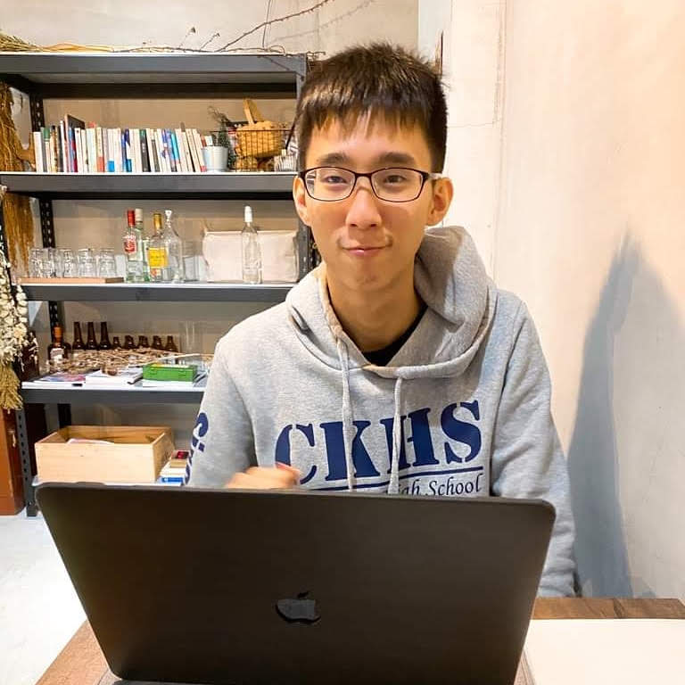

## About Me
- I am a 1st year MSCS student at Georgia Tech broadly interested in
    - cryptography (SNARKs, secret sharing), blockchains (consensus algorithms, smart contracts)
    - machine learning
    - competitive programming
- some facts
    - I ranked 541st (top 0.56%) in Google Code Jam 2020
    - I scored multiple A+s in hardcore courses in Theoretical CS/Math (e.g. Quantum Computation and Quantum Information, Quantum Machine Learning, Advanced Algorithms, Intractable Problems, Advanced Linear Algebra, Algebra)
    - I won ~9k at ETH Global Paris, a global hackathon with 1400 attendees and 321 projects.
- Here is my [1-page CV](https://drive.google.com/file/d/16nkGvbMUJJ8JabQOxMNzgntl9-LsBaEd) and [CV with projects and leadership](https://drive.google.com/file/d/1ntaSsTQ9a0-AxTWxOlPUJBn5N1Ntv3ho/view?usp=sharing), example writing is in the theory project section
- Please see my CV for my professional information since this site is static and can be outdated (last modified: Sep 8th 2023).

---

## Hobbies and Interests
- Listening music, playing games
- Researching healthy diet
- Exercising (weight training and Zone 2 running)
- Playings guitar, piano
    - [Me playing Fight, an acoustic guitar song](https://youtu.be/XmpmadFYGOk)
- Traveling
    - I was proudly [hosted by Antalpha Hacker House](https://youtu.be/MSYaon4zNsc?si=ac7TzA_bLDmVUMfR) as a hacker during ETH CC in Paris

---

## Addresses
0xb1B6356EA9E2f3Bf9867d6Ac1c1Bfd2cB1553Abb  
ytlin.eth  
maxwill.sol
